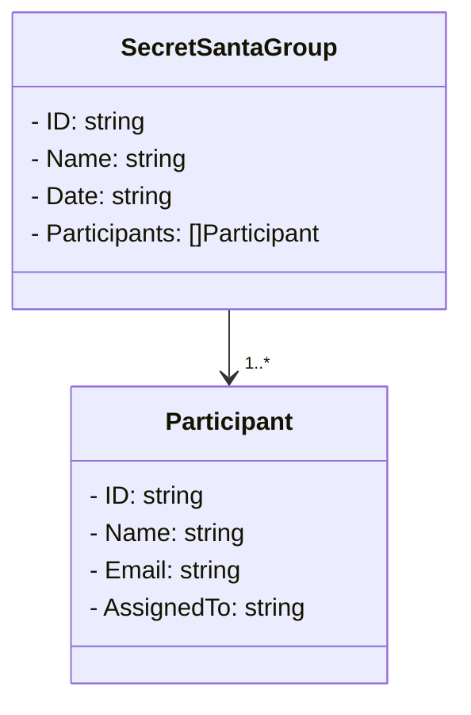

# Secret Santa comes and Go(es) 🎅

## Introduction
#### What is Secret Santa?
Secret Santa is a popular holiday tradition where a group of participants exchange gifts. Each person is assigned someone at random to give a gift to, while keeping their identity a secret until the gift exchange event. It's a fun way to celebrate the holiday season, promote camaraderie, and add an element of surprise to gift-giving.

#### Business requirements 
Here at Omnichannel, Manufacturing and Product Engineering, we want to facilitate the tradition of Secret Santa in multiple teams, in order to do that a Secret Santa API must be built. This API can include an endpoint that automates the matching of participants, ensuring that no one knows who their Secret Santa is until the big reveal. 

## Objective
The objective of this assignment is to develop a RESTful API in the Go programming language to facilitate the organization of Secret Santa events. You will be working with two key objects: `SecretSantaGroup` and `Participant`, along with appropriate API endpoints to manage these objects. Additionally, you will add an endpoint to generate Secret Santa matches for a specific group.


## Instructions
1.  **SecretSantaGroup Object:**
    
    -   Create a `SecretSantaGroup` object that will represent a Secret Santa event. It should have the following attributes:
        -   `ID` (string): A unique identifier for the group.
        -   `Name` (string): The name of the Secret Santa event.
        -   `Date` (string): The date of the event.
        -   `Participants` ([]Participant): An array of participants in the group.
2.  **Participant Object:**
    
    -   Create a `Participant` object that represents an individual participating in the Secret Santa event. It should have the following attributes:
        -   `ID` (string): A unique identifier for the participant.
        -   `FullName` (string): The name of the participant visible to the administrators.
        -   `SecretSantaNickname` (string): The nickname that the participant chooses to show to the person that must pick a gift for them.
        -   `Email` (string): The email address of the participant.
        -   `AssignedTo` (string): The ID of the participant to whom this participant is assigned to be a Secret Santa.

3. **API Endpoints:**

-   Implement the following RESTful API endpoints:
    
    -   `GET /groups`: Retrieve a list of all Secret Santa groups.
        
    -   `GET /groups/{groupID}`: Retrieve details about a specific Secret Santa group.
        
    -   `POST /groups`: Create a new Secret Santa group.
        
    -   `PUT /groups/{groupID}`: Update an existing Secret Santa group's details
    
    -   `GET /participants/{participantID}`: Retrieve details about a specific participant.
        
    -   `POST /participants`: Add a new participant to a Secret Santa group.
        
    -   `PUT /participants/{participantID}`: Update the details of a participant.     
        
    -   `POST /groups/{groupID}/assign`: Assign Secret Santas within a group. The server should automatically assign participants to each other following the Secret Santa tradition, ensuring that no participant is assigned to themselves and that each participant is assigned to only one other participant.

4. **Data Storage:**

-   Use an in-memory data store (e.g., a Go map) to store the `SecretSantaGroup` and `Participant` objects. Data does not need to persist beyond the runtime of the application.

5. **Extra Credit (Optional):**
- Implement validation for input data to ensure the API gracefully handles invalid requests.
- Implement error handling and status codes appropriately for each API endpoint. For example, invalid request must produce a Bad Request which is HTTP Code 400
- Write unit tests for your code to ensure API functions as expected.

## Hints:

### Key GO components

Key components that one should look into when developing this web service:
- HTTP Server (from for example the standard library)
- HTTP router (from for example mux library)
- A service (you build this struct, that would have In-memory Database)

### Architecting application (Key GO components part 2)

It is hard to architect an application.
Sometimes just knowing the key components is not enough. 
And since a picture is worth a thousand words, here is an ASCII picture

<details>
  <summary>Show picture</summary>


```
+---------------------+
|     Main Method    |
|---------------------|
|    Create Router   |
|    Create Service  |
+---------------------+
         |
         |   +------------------+
         |   |     Router       |
         +-->|------------------|
             | Define Routes    |
             | Use Service      |
             +------------------+
                    |
                    |    +------------------+
                    |    |    Service       |
                    +--->|------------------|
                         | Data Store (In-memory) |
                         +------------------+

```
</details>

### Architecting application (Key GO components part 3)

Sometimes just knowing the key components and having a picture of it, is not enough. 
Sometimes some starter code is required.

!NB: This code is for illustrative purposes and may not run
<details>
  <summary>Show code</summary>

```go
package main

import (
    "net/http"

    "github.com/gorilla/mux"
)

// Service represents your in-memory data service.
type Service struct {
    // Data store or any other service-specific fields can be defined here.
}

// NewService creates a new instance of the Service.
func NewService() *Service {
    return &Service{}
}

// HandlerFunc represents a generic HTTP request handler.
type HandlerFunc func(w http.ResponseWriter, r *http.Request, s *Service)

// Your handler functions can be defined here.
func exampleHandler(w http.ResponseWriter, r *http.Request, s *Service) {
    // Handle the request using the service.
    // You can access the in-memory data store in the service here.
}

func main() {
    // Create a new service instance.
    service := NewService()

    // Create a new router (e.g., using Gorilla Mux).
    router := mux.NewRouter()

    // Define your API routes and associate them with handlers.
    router.HandleFunc("/example", func(w http.ResponseWriter, r *http.Request) {
        exampleHandler(w, r, service) // Pass the service to the handler.
    }).Methods("GET")

    // Start the HTTP server with the router.
    http.Handle("/", router)
    http.ListenAndServe(":8080", nil)
}


```

</details>

### Validating (Optional)

One of the extra optional tasks is validation.
Validation is crucial in any application to ensure that the data it receives is accurate, consistent, and safe.

The Go validator library is a popular choice for implementing data validation in Go applications. 

Importing the library happens with the command:

```bash
go get github.com/go-playground/validator/v10
```

Then you must use struct tags to specify validation rules for your struct fields on the Input Object you send during the HTTP Request.
An example of using struct tags is shown here: https://github.com/go-playground/validator/blob/master/_examples/simple/main.go

The last thing we must do is create and pass the validator instrance to the handler. It would be used in the same manner as our service.
Creating a validator instance happens in the main function.

### IDs that are strings (only read if extra time or curious)

When one needs to use an id which is required to be a string, you could just stringify an intiger for example a string id of "1" is perfectly valid. 
This however introduces the problem of collision, it is pretty easy to type "1" and "1" again, obvisouly the point of IDs is that they have to be unique.
For this reason only you can use something called GUID https://golangbyexample.com/generate-uuid-guid-golang/