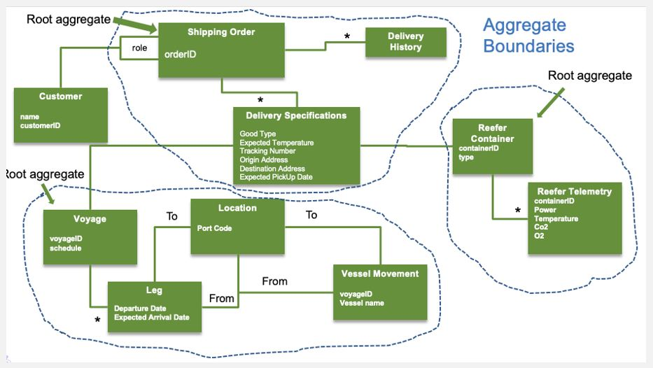
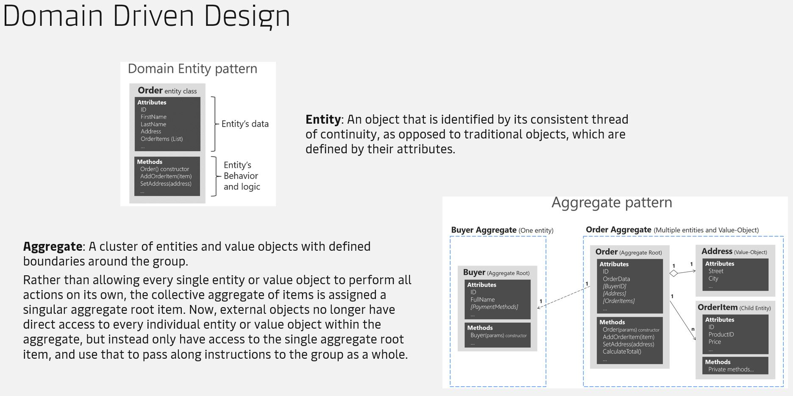

# B. Architecture Track

- [Start](README.md)
- [Next](C_real_world_track.md)

---

## Intro

| Topic | Link |
| ----------- | ----------- |
| Domain Driven Design | [https://ibm-cloud-architecture.github.io/refarch-eda/methodology/domain-driven-design/](https://ibm-cloud-architecture.github.io/refarch-eda/methodology/domain-driven-design/) |

### Bounded Context

Bounded Context explicitly defines the boundaries of your model. A language in one bounded context can model the business domain for the solving of a particular problem. This concept is critical in large software projects. A Bounded Context sets the limits around what a specific team works on and helps them to define their own vocabulary within that particular context.

### Entity and Aggregate

### Repositories

Repository represents the infrastructure service to persist the root aggregate during its full life cycle. Client applications request objects from the repository using query methods that select objects based on criteria specified by the client, typically the value of certain attributes. Application logic never accesses storage implementation directly, only via the repository.

### Examples

See [ddd_aggregate_root.go](B/ddd_aggregate_root.go)

Go playground: [https://go.dev/play/p/PemYEj0z1Bh](https://go.dev/play/p/PemYEj0z1Bh)

---

- [Start](README.md)
- [Next](C_real_world_track.md)
