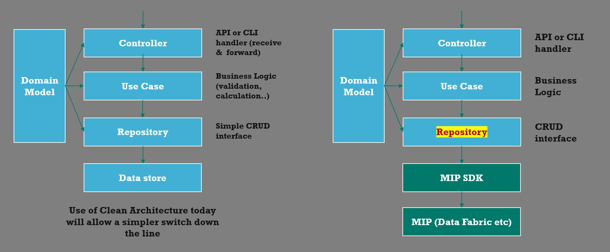

# Architecture Track

- [Start](README.md)
- [Next](C_real_world_track.md)

---

## Week 2

---
NB: Something is rotten in the state of Main, can you figure out what is the issue?
---

| Topic | Link |
| ----------- | ----------- |
| Clean Architecture | [blog.cleancoder.com/uncle-bob/2012/08/13/the-clean-architecture.html](https://blog.cleancoder.com/uncle-bob/2012/08/13/the-clean-architecture.html) |


The concentric circles represent different areas of software. In general, the further in you go, the higher level the software becomes. The outer circles are mechanisms. The inner circles are policies.

The overriding rule that makes this architecture work is The Dependency Rule. This rule says that source code dependencies can only point inwards. Nothing in an inner circle can know anything at all about something in an outer circle. In particular, the name of something declared in an outer circle must not be mentioned by the code in the an inner circle. That includes, functions, classes. variables, or any other named software entity.

By the same token, data formats used in an outer circle should not be used by an inner circle, especially if those formats are generate by a framework in an outer circle. We don’t want anything in an outer circle to impact the inner circles.

### Benefits

- **Independent of Frameworks**. The architecture does not depend on the existence of some library of feature laden software. This allows you to use such frameworks as tools, rather than having to cram your system into their limited constraints.

- **Testable**. The business rules can be tested without the UI, Database, Web Server, or any other external element.

- **Independent of UI**. The UI can change easily, without changing the rest of the system. A Web UI could be replaced with a console UI, for example, without changing the business rules.

- **Independent of Database**. You can swap out datastores, for something else. Your business rules are not bound to the database.

- **Independent of any external agency**. In fact your business rules simply don’t know anything at all about the outside world.

### Physical implementation in Go

The diagram below shows the separation of layers that we will implement and a possible future showing how a subsequent switch to MIP would impact our code

- domain (model)
- controller (HTTP, grpc, cli etc)
- use case (business logic)
- repository (access to backend cloud services, datastores, brokers etc)



### Real World Example

[B/cmd/main.go](B/cmd/main.go)

```go run B/cmd/main.go```

---

- [Start](README.md)
- [Next](C_real_world_track.md)
